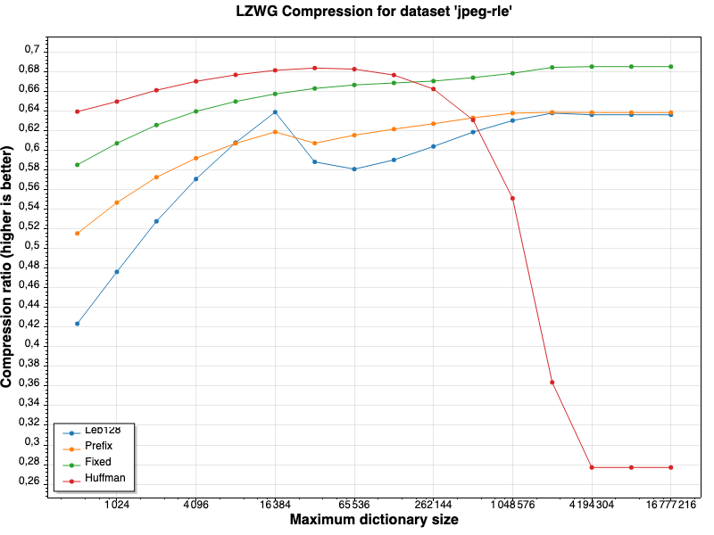
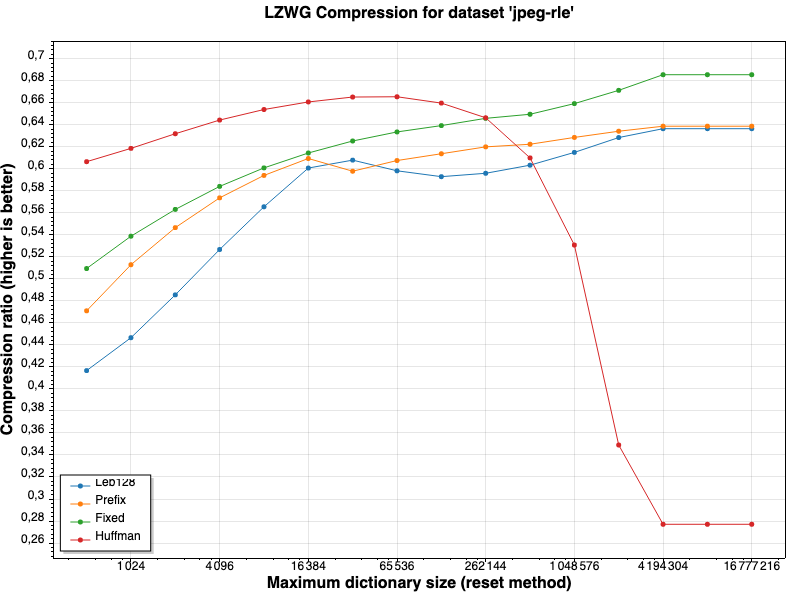

# LZWG

LZWG (Lempel–Ziv–Welch-Giniaux) is a variant of the LZW algorithm that keeps tracks of the least recently used entries in the dictionary to evict them and effectively bound the dictionary size. This addresses the main drawback of the LZW algorithm where the dictionary size can grow indefinitely, producting symbols of high cardinality, which becomes a limiting factor when it comes to encoding them in as little bits as possible.  
Using LZWG with an `int.MaxValue` as the maximum dictionary size will effectively make it behave like the LZW algorithm.

## Usage

```csharp
using Lzwg;

string loremIpsum = ...;
List<int> compressed = Lzwg.Compress<char>(loremIpsum, BaseDictionaries.Ascii, 1000);
List<char> decompressed = Lzwg.Decompress<char>(compressed, BaseDictionaries.Ascii, 1000);

Assert.AreEqual(loremIpsum, new string(CollectionsMarshal.AsSpan(decompressed)));
```

Notes:
- Use the same dictionary and max size for both compression and decompression.
- Use max size greater than the dictionary size (or an exception will be thrown).
- As for any LZW implemetation, the methods are not thread-safe.

## Benchmarks

These benchmarks computes the compression ratio with the dictionary maximum size varying. For higher values, the LZWG algorithm will behave excatly like the LZW algorithm. The benchmarks considers differents ways of encoding compressed indices:
- **Leb128** is a variable-length encoding for integers commonly used in WebAssembly, DWARF, protobuf and other binary formats. 
- **Prefix** consist in writing a fixed size prefix indicating how many bits the integer is encoded with, followed by the integer itself. Let's take 123456789 as an example. This integer takes 27 bits, so if we assume all integers will be at most 32 bits, we can write the prefix for 27 bits (11011) followed by the 27 bits representing integer.
- **Fixed** is a fixed size encoding commonly used in LZW implementations. We simply write integers with a fixed size that depends on the dictionary size. For example, if the dictionary size is 1000, we will write integers with 10 bits.
- **Huffman** uses the package-merge algorithm to build a Huffman tree and encode the compressed indices with it. This is a very efficient way to encode integers, but requires serializing the tree itself, which can defeat the purpose of the compression if we have too many huffman codes (or if the dictionary size is too big).

| Using LRU (LZWG) | Using dictionary reset method |
|---|---|
|   |  |
| The most efficient compression is using huffman encoding with a limited dictionary size of about 32k entries. We can see that with an unbounded dictionary the huffman encoding is not viable for this dataset as the huffman table itself will require a lot of space for its storage. | Here we compare with the "traditional" way to limiting the dictionary size, which consists in reseting the dictionary every time it reaches some defined maximum size. We can see that LZWG slightly outperforms this approach. |

Make sure to benchmark LZWG with your own data and dictionary size to see if it fits your needs.

## Performance

This C# implementation uses `ArraySegment<T>` for minimal allocations and O(1) operations all the way through. This makes the implementation very efficient. Yet, the algorithm could benefit from further work and fast paths for optimal performance. Repository is open for contributions and suggestions.